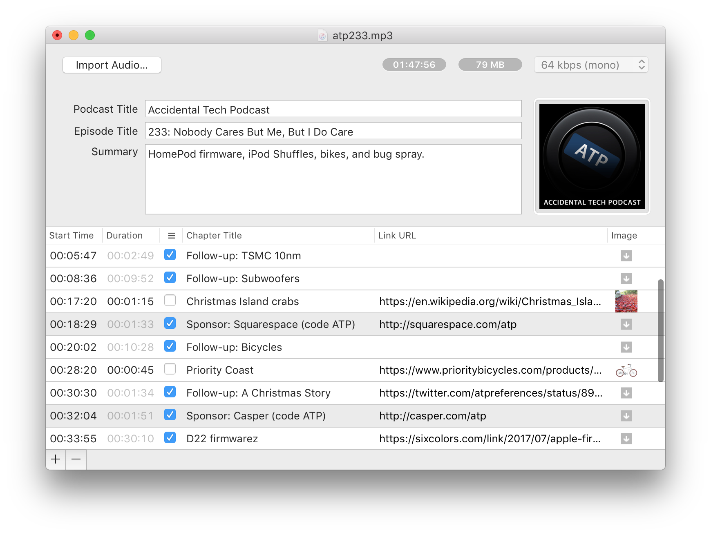

### Software y herramientas utilizados

* Hardware
     - Macbook 15"
     - Macbook Air 11"
     - Macbook 13"
     - Satechi Type-C Multiport Adapter
     - _Hosting_: Consorcio Saavedra 15

* Software
     - [Voice Record Pro](https://apps.apple.com/ar/app/voice-record-pro/id546983235): grabador de voz para dispositivos iOS. Consulte la versión para dispositivos [Android](https://play.google.com/store/apps/details?id=ca.bejbej.voicerecordpro&hl=es)
     - [Forecast](https://overcast.fm/forecast): herramienta de post-producción para archivos en formato `.mp3` diseñado, desarrollado y usado por los podcasters profesionales
  
     - [Ardour](https://ardour.org/): edición de sonido multi-plataforma
     - [Audacity](http://www.audacityteam.org): edición de sonido. Este software ofrece la función de "reducción de sonido ambiental"
     - [Wavosaur](http://www.wavosaur.com/): edición de sonido
     - [Acoustica Basic Edition](https://acondigital.com/products/acoustica-audio-editor/): edición de sonido
     - [Audiotool](https://www.audiotool.com/): edición de sonido
     - [Blue Cat's FreqAnalyst](https://www.bluecataudio.com/Products/Bundle_FreewarePack/): análisis de las frecuencias sonoras
     - [Blue Cat's Triple EQ](https://www.bluecataudio.com/Products/Bundle_FreewarePack/): equalizador de sonido
     - [Decibel X:dB Sound Level Meter](https://apps.apple.com/us/app/decibel-10-noise-db-meter-fft-frequency-analyzer/id448155923): medidor de nivel sonoro para dispositivos iOS. Consulte la versión para dispositivos [Android](https://play.google.com/store/apps/details?id=com.skypaw.decibel&hl=es_AR)
     - [AbePlayer](https://ableplayer.github.io/ableplayer/): herramienta de análisis del nivel de accesibilidad de un video
     - [VideoJs](https://videojs.com/): reproductor de video HTML5
* Herramientas en línea
     - [Podcast publisher tools](https://search.google.com/devtools/podcast/preview): verifica que un podcast está disponible en Google Podcasts para luego crear un enlace directo (`URL`) del mismo
     - Revisar [Podcasts providers](Podcasts_providers.md)   
* Documentación
     - [Sign language](https://www.w3.org/WAI/media/av/sign-languages/)
     - [Transcripts](https://www.w3.org/WAI/media/av/transcripts/#checklist)
     - [Media player accessibility](https://www.w3.org/WAI/media/av/player/)
     - [Making Audio and Video Media Accessible](https://www.w3.org/WAI/media/av/)
     - [Web-Based Media Player Accessibility Comparison Table](http://kensgists.github.io/apt/)
     
### Legales

* Todas las marcas registradas son propiedad de sus respectivos propietarios.
