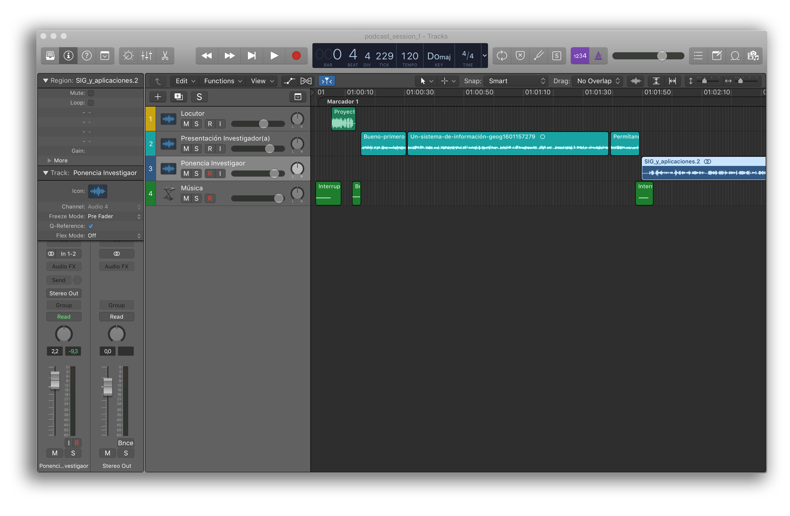
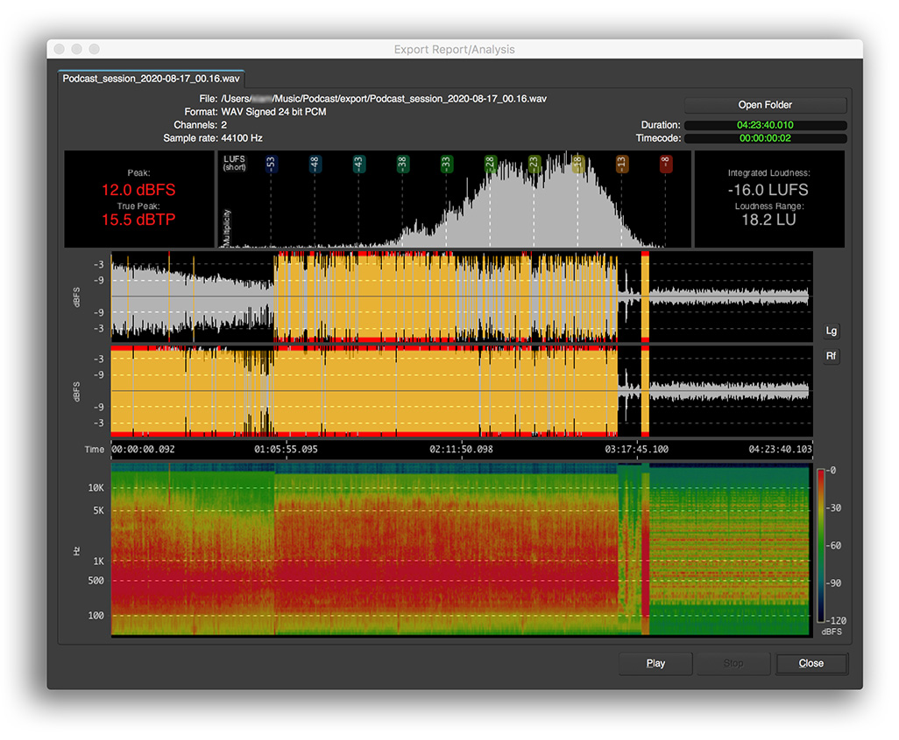
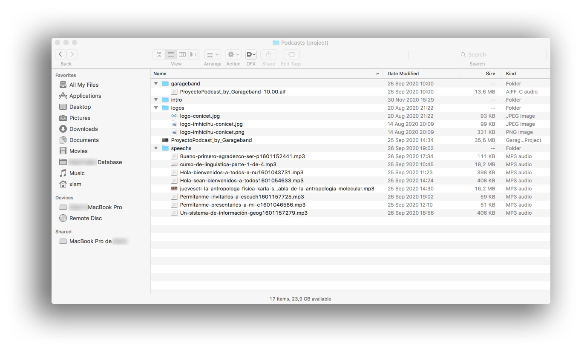
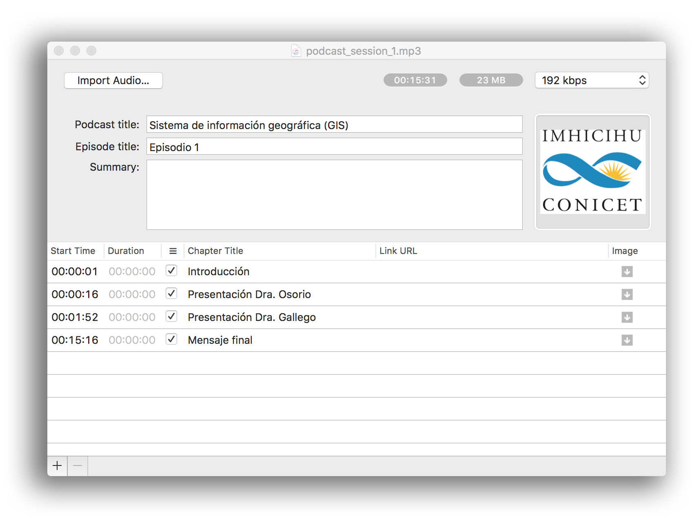

  

---

## Rationale / [Motivación](LEEME.md) #
* Este repositorio recopila herramientas tecnológicas en el marco de una iniciativa interna destinada a producir y generar comunicaciones audiovisuales para la comunidad
* Este repositorio es un documento en constante evolución que irá creciendo y adaptándose con el tiempo

### ¿Para qué sirve este repositorio?

* Resumen rápido
    - Estrategias, ideas y aprendizajes en el ámbito de la comunicación audiovisual

### ¿Cómo lo configuro?

* Resumen de la configuración
    - Para empezar, puedes consultar nuestro _colofón_ (vea más abajo): hay diversas herramientas (de código abierto) para convertir datos analógicos (_la voz humana_) al ámbito digital
* Dependencias
    - Muchas [herramientas](Colofon.md) requieren numerosas dependencias. No existe una normativa universal que se aplique a todas
* Configuración de la base de datos
    - No hay ninguna base de datos para [CRUD](https://en.wikipedia.org/wiki/Create,_read,_update_and_delete)
* Instrucciones de implementación
    - Consulta nuestras [Buenas prácticas](Buenas_practicas.md) y [Buenas prácticas en la grabación de podcasts](Buenas_practicas_grabacion_podcast.md)
    - Consulta nuestras [cuestiones de seguridad y privacidad](security_privacy_issues.md)

### Registro de cambios

* Consulta la sección [Commits](https://github.com/imhicihu/AUvisual/commits/master) para conocer el estado actual

### Código de conducta

* Consulta nuestro [Código de conducta](Code_of_conduct.md)

### Aspectos legales

* Todas las marcas registradas son propiedad de sus respectivos titulares

### Licencia

* El contenido de este proyecto está sujeto a una 
