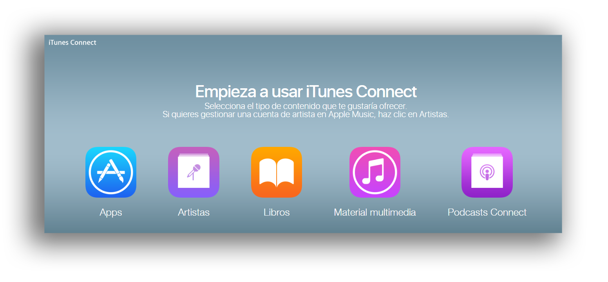
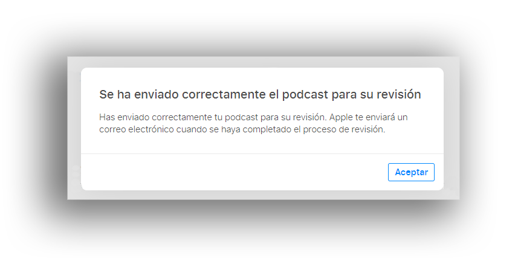

* Ingresar a [Podbean](https://www.podbean.com/)
* Ir a `Configuración` –> `General` –> `Feed Itunes` = `Rss feed`
* Copiar dicho enlace correspondiente al `RSS Feed`
* Ir a [iTunes Connect](https://itunesconnect.apple.com/)
* Iniciar sesión (si se posee un Apple ID y su contraseña)
* Se verá esta pantalla
 
* Clic sobre `Podcasts connect`
* Una vez dentro, pegar el enlace (`RSS Feed`) previamente copiado (obsérvese la línea #3). Luego clic sobre `Validar`
* Ingresar todos los datos requeridos
* Si el enlace es correcto, se verá una pantalla con todos los datos del podcast
 
* Muy pronto se recibirá un correo electrónico donde se advertirá que el podcast está listo