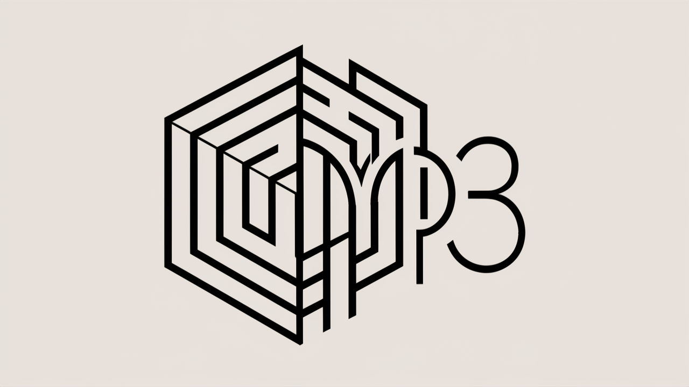
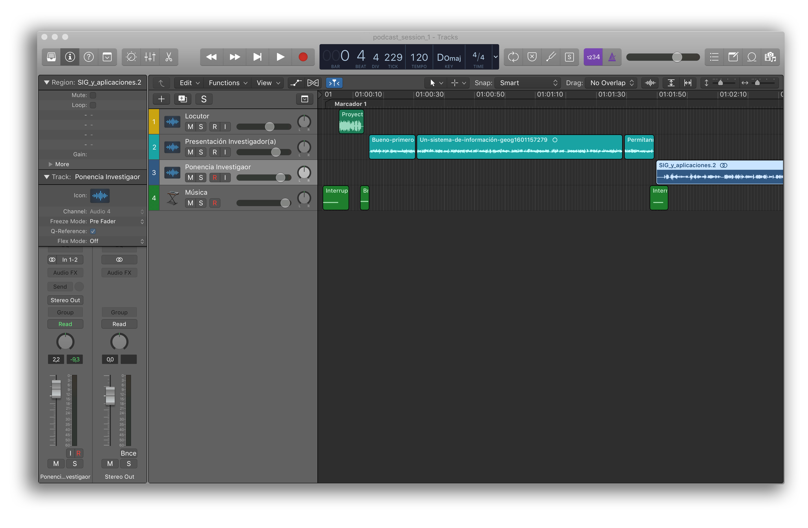
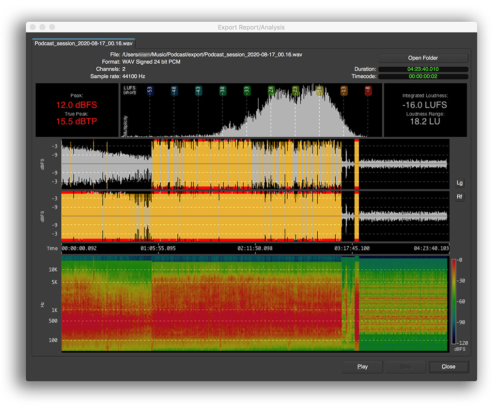
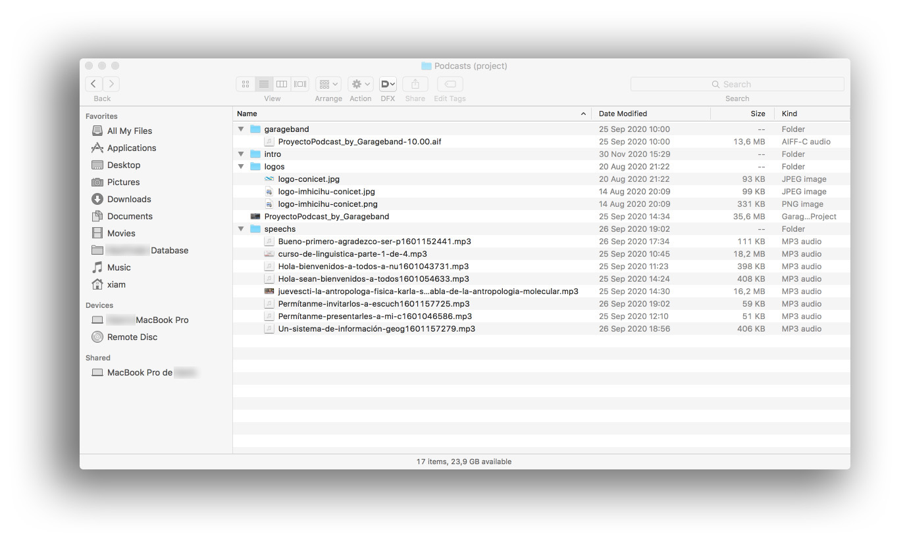

---

# RATIONALE #
* This repo collects technological tools and human insights inside an internal effort to produce, generate audiovisual communications to the community
* This repo is a living document that will grow and adapt over time

### What is this repository for?

* Quick summary
    - Strategies, insights and learnings in audio & visual communications

### How do I get set up?

* Summary of set up
    - In the beginning, you can check our _colophon_ (see below): lots of (open source) tools to convert analog data (_human voice_) to the digital realm
* Configuration
    - Check up [colophon.md](Colophon.md)
* Dependencies
    -  Lots of [tools](Colophon.md) needs lots of dependencies. There is no universal governance that applies to all
* Database configuration
    - There is no database to [CRUD](https://en.wikipedia.org/wiki/Create,_read,_update_and_delete)
* Deployment instructions
    - Check our [Buenas prácticas](Buenas_practicas.md) y [Buenas prácticas en grabación de podcasts](Buenas_practicas_grabacion_podcast.md)
    - Check our [security & privacy issues](security_privacy_issues.md)

### Changelog

* Please check the [Commits](https://github.com/imhicihu/AUvisual/commits/master) section for the current status

### Code of Conduct

* Please, check our [Code of Conduct](Code_of_conduct.md)

### Legal

* All trademarks are the property of their respective owners

### License ###

* The content of this project itself is licensed under the 
