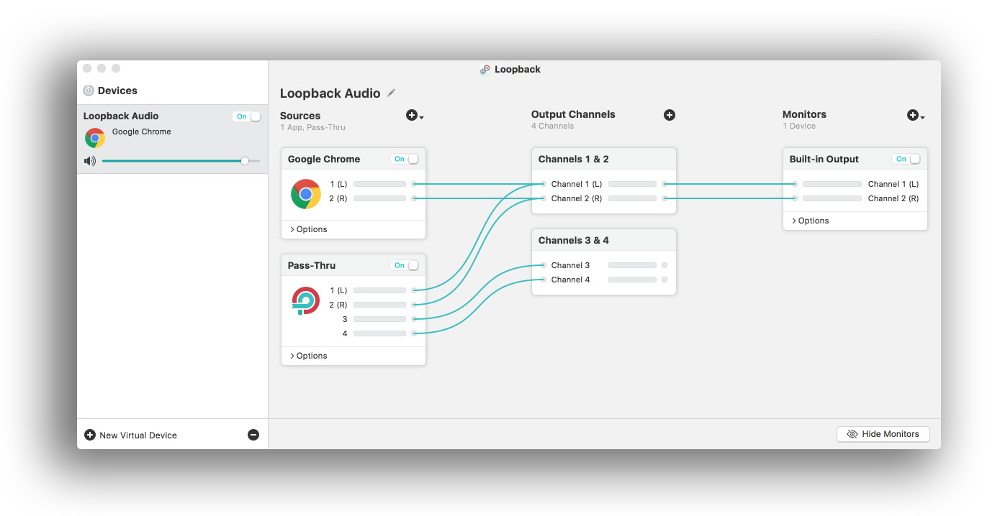

### Software

* Android
    - [Voice Recorder](https://play.google.com/store/apps/details?id=com.media.bestrecorder.audiorecorder&hl=en_US)
    - [Smart Recorder](https://play.google.com/store/apps/details?id=com.andrwq.recorder)
    - [Grabadora de voz - ASR](https://play.google.com/store/apps/details?id=com.nll.asr)
    - [Google Recorder](https://play.google.com/store/apps/details?id=com.google.android.apps.recorder&hl=en_US)
* iOS
    - [Ferrite](https://apps.apple.com/es/app/ferrite/id1018780185)
* Aplicación
    - [Zencastr](https://zencastr.com/): 
        - ideal para entrevistas
        - sin necesidad de instalar nada
        - necesita conexión a internet
        - Una vez terminada la entrevista, se envía automáticamente a Dropbox o Google Drive
            - Tutoriales:
                - https://www.youtube.com/watch?v=ksoGFc8w8Mw
                - https://www.youtube.com/watch?v=YKT6SK2BaoM
                - https://www.youtube.com/watch?v=rySsnlNzaw8

### Grabación
* Consideraciones técnicas
    - formato de grabación: `.mp3` o `.wav`
    - calidad de grabación: 192 kbps
* Proceso
    * Instalar la aplicación en su dispositivo
    * Lanzar la aplicación
    * Clic en el botón `rojo`
    * Cuente mentalmente hasta el número `3`
    * Empiece a grabar su _speech_
    * Una vez que haya finalizado su _parlamento_, cuente mentalmente hasta el número `3`. Luego clic en el botón `rojo`
    * Acaba de registrar su participación.
    * Envíe dicho registro a este correo electrónico: `****@gmail.com`
    
### Speech synthesis

