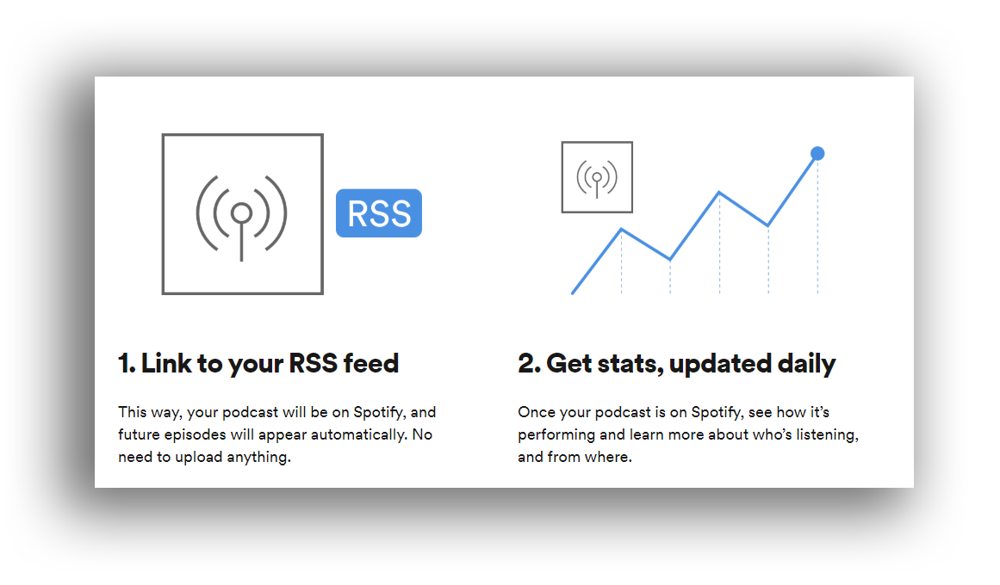

## Preliminar data
* [Spotify for podcasters](https://podcasters.spotify.com/)
* Spotify doesn’t host podcasts. We must provide a link to an `RSS` feed in order to have your podcast on Spotify.
* Podcast providers (supported by Spotify):
	- Acast
	- Anchor (_preferred_)
	- Audioboom
	- Backtracks
	- Blubrry
	- Buzzsprout
	- Castos
	- Captivate
	- Fireside
	- iono.fm
	- LibSyn
	- Megaphone
	- Omny
	- Pinecast
	- PodBean ~~(_preferred_)~~
	- Podcaster.DE
	- Podiant
	- Podigee
	- Podomatic
	- RedCircle
	- Simplecast
	- Spreaker
	- Transistor
	- Whooshkaa

## Procedures ##
* [Log in](https://accounts.spotify.com/login?continue=https%3A%2F%2Fpodcasters.spotify.com%2Fgateway) to Spotify for Podcasters with your Spotify account, or choose `Sign Up` to create one.
* Click `Get started`.
* Paste in the link to your podcast's `RSS` feed.
* We’ll now send a verification email to the address in your RSS feed. Copy the 8-digit code from that email and paste in the submit form.

* Add podcast info like the `category`, `language` and `country`.
* It may take a couple hours for your public `RSS` feed to update, and for Spotify to recognize those updates.
* Spotify's Podcast Technological specification can be seen [here](https://podcasters.spotify.com/terms/Spotify_Podcast_Delivery_Specification_v1.6.pdf)